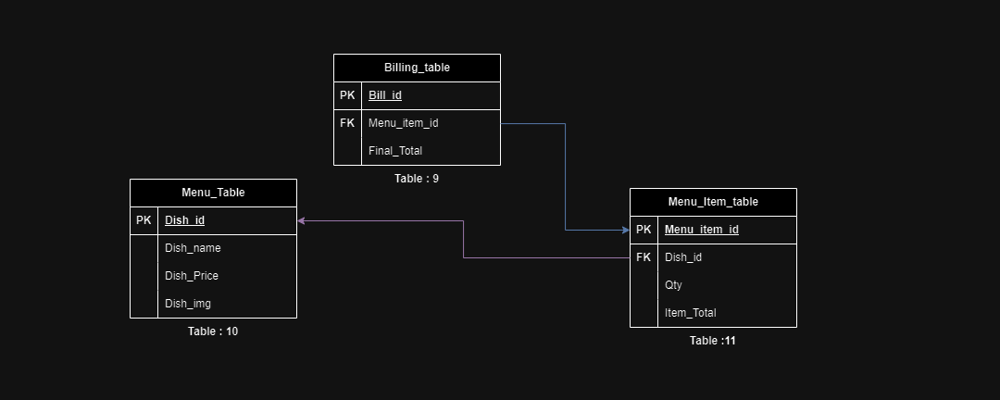

# User login and management 
 

### Table 1: User_details
This table contains user details such as name, Address and user Role(Owner, manager, employee, job seekers).

### Table 2: User_Roles
This table contains roles of the user.

### Table 3: Owner table
This table has FK referece to manager_id, Hotel_id and Posted_job_id if he posts a job.

### Table 4: Manager table
This table has FK reference to Posted_job_id, Hotel_id, Application_id if he applies to any other job.

### Table 5: Employee
This table contains employee details such as employee designation salary.

### Table 7: Hotel_Details
This table conatains hotel details like hotel name and Location.

### Table 6: Jobs_posted
This table stores the information regarding the jobs available.

### Table 8: Application
This table can be used to store the details of the applications applied for the job.

# Create Orders
  

### Table 9: Billing_table
This table will conatin the details of the each order by the custormer.

### Table 10: Menu_table
This table contains information of all the menu items present in the hotel.

### Table 11: Menu_item_table
This table contains the details of all the single items orders in what quantity.
