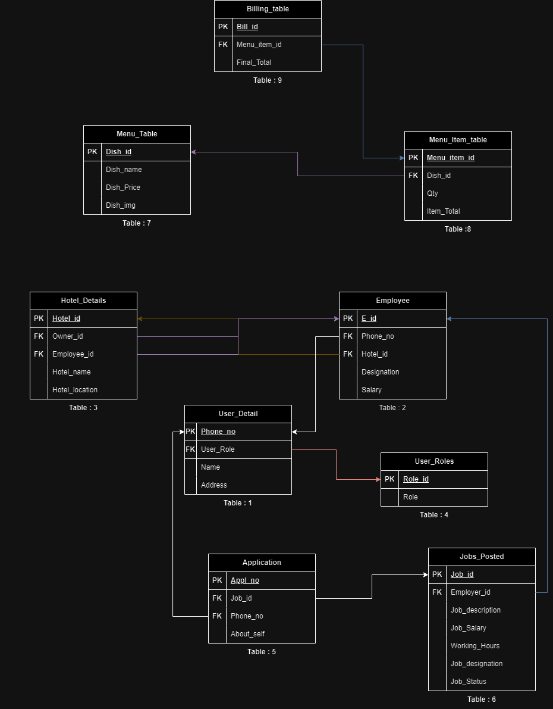

  

### Table 1: User_details
This table contains user details such as name, Address and user Role(Owner, manager, employee, job seekers).

### Table 2: Employee
This table contains employee details such as employee designation salary.

### Table 3: Hotel_Details
This table conatains hotel details like hotel name and Location.

### Table 4: Roles
This table contains roles of the user.

### Table 5: Application
This table can be used to store the details of the applications applied for the job.

### Table 6: Jobs_posted
This table stores the information regarding the jobs available.

### Table 7: Menu
This table contains information of all the menu items present in the hotel.

### Table 8: Menu_item_table
This table contains the details of all the single items orders in what quantity.

### Table 9: Billing_table
This table will conatin the details of the each order by the custormer.
jshuss
This table contains
