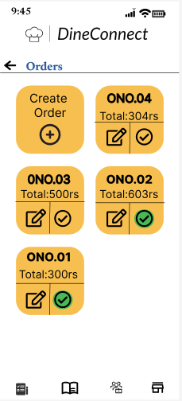
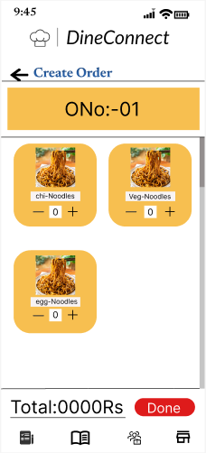
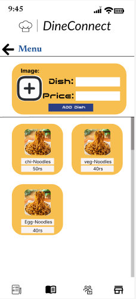
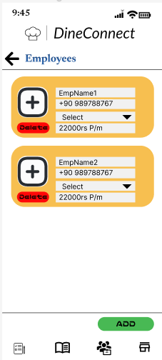
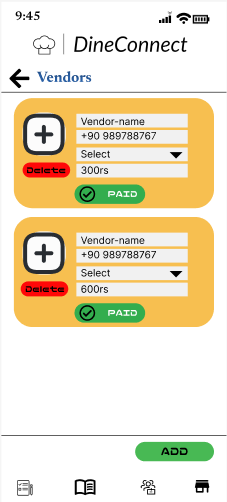

# DineConnect

The goal of this project is to develop a smartphone application that will assist small hotel owners with their everyday tasks, such as calculating their daily income and making account maintenance simpler. They can use it to look for workers like waiters and chefs, among other positions.

## Login

If the user is a new one, they must submit their personal information like name, mobile number, and establish a new username, which will be kept in the database. It performs a straightforward OTP-based login function in which the user must enter their cellphone number for which they receive OTP that allows them to login.

<table>
  <tr>
    <td>
      
    </td>
    <td>
      
    </td>
    <td>
      
    </td>
  </tr>
  <tr>
    <td>
      Fig1: Login image
    </td>
    <td>
      Fig2: Add OTP image
    </td>
    <td>
      Fig3: Create Account image
    </td>
  </tr>
</table>

## Job Portal Application
Job portal applications have a home page on which the owner posts information about open positions. Users can use this website to hunt for workers in a variety of roles, including waiters and cooks.The owner can fill up information about the job opening, including working hours and remuneration, in the section in the second frame.People who are looking for work will see it on the home page, and those who are interested can apply by once more filling out the necessary information. 

### Home

The user can find all the open positions offered by owners or organizations here in the Home area. On clicking "Request Quote"  user can apply for the job

<table>
  <tr>
    <td>
      
    </td>
    <td>
      
    </td>
  </tr>
  <tr>
    <td>
      Fig4: Home page
    </td>
    <td>
      Fig5: Request Quote page
    </td>
  </tr>
</table>

### Post a Job

In this section the user can post jobs 

<table>
  <tr>
    <td>
      
    </td>
  </tr>
  <tr>
    <td>
      Fig6: Post a job page
    </td>
  </tr>
</table>

### Notification Section

The user is notified in this section of the application

<table>
  <tr>
    <td>
      
    </td>
    <td>
      
    </td>
  </tr>
  <tr>
    <td>
      Fig7: Notification section
    </td>
    <td>
      Fig8: On clicking and Notification
    </td>
  </tr>
</table>

### Settings

This is the settings section of the whole application, in which the user can change personal information.

<table>
  <tr>
    <td>
      
    </td>
    <td>
      
    </td>
  </tr>
  <tr>
    <td>
      Fig9: Settings section
    </td>
    <td>
      Fig10: Accounts section
    </td>
  </tr>
</table>

## Income calculator

The user of the Income Calculator will be able to save their hotel menu in the program and use it to produce orders accordingly. It also assists in keeping track of staff and vendors, as well as their salaries.

<table>
  <tr>
    <td>
      
    </td>
    <td>
      
    </td>
    <td>
      
    </td>
  </tr>
  <tr>
    <td>
      Fig11: Main page
    </td>
    <td>
      Fig12: Orders page
    </td>
    <td>
      Fig13: Create order page
    </td>
  </tr>
</table>

<table>
  <tr>
    <td>
      
    </td>
    <td>
      
    </td>
    <td>
      
    </td>
  </tr>
  <tr>
    <td>
      Fig14: Menu image
    </td>
    <td>
      Fig15: Employees page
    </td>
    <td>
      Fig16: Vendors page
    </td>
  </tr>
</table>

## Creating and Displaying of Order page 

The order page, which the user can access in Fig. 12, is shown. Clicking the "Create Order" button will bring up the following screen, shown in Figure 13, where the user can add the names of dishes to the order list and calculate the total. Additionally, the user has the choice to mark a bill as paid when payment has been received; this action is denoted by a green check mark.

## Employee page

The user can add information for hotel employees in the employee page shown in Figure 15 (ie), including their name, phone number, job title (e.g., waiter, maintenance, cleaner), and monthly income.

## Vendors Page

The user can add information about vendors in the vendor page shown in Figure 16 (ie), including their name, phone number, type of vendor, and due paid .

