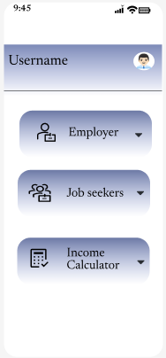

# DineConnect

The goal of this project is to develop a smartphone application that will assist small hotel owners with their everyday tasks, such as calculating their daily income and making account maintenance simpler. They can use it to look for workers like waiters and chefs, among other positions.

## Loging In

If the user is a new one, they must submit their personal information like name, mobile number, and establish a new username, which will be kept in the database. It performs a straightforward OTP-based login function in which the user must enter their cellphone number for which they receive OTP that allows them to login.

<table>
  <tr>
    <td>
      
    </td>
    <td>
      
    </td>
    <td>
      
    </td>
  </tr>
  <tr>
    <td>
      Fig1: Login image
    </td>
    <td>
      Fig2: Add OTP image
    </td>
    <td>
      Fig3: Create Account image
    </td>
  </tr>
</table>

## Job Portal Application
Job portal applications have a home page on which the owner posts information about open positions. Users can use this website to hunt for workers in a variety of roles, including waiters and cooks.The owner can fill up information about the job opening, including working hours and remuneration, in the section in the second frame.People who are looking for work will see it on the home page, and those who are interested can apply by once more filling out the necessary information. 

### Home

The user can find all the open positions offered by owners or organizations here in the Home area. On clicking "Request Quote"  user can apply for the job

<table>
  <tr>
    <td>
      
    </td>
    <td>
      
    </td>
  </tr>
  <tr>
    <td>
      Fig4: Home page
    </td>
    <td>
      Fig5: Request Quote page
    </td>
  </tr>
</table>

### Post a Job

In this section the user can post jobs 

<table>
  <tr>
    <td>
      
    </td>
  </tr>
  <tr>
    <td>
      Fig6: Post a job page
    </td>
  </tr>
</table>

### Notification Section

The user is notified in this section of the application

<table>
  <tr>
    <td>
      
    </td>
    <td>
      
    </td>
  </tr>
  <tr>
    <td>
      Fig4: Notification section
    </td>
    <td>
      Fig5: On clicking and Notification
    </td>
  </tr>
</table>

### Settings

This is the settings section of the whole application, in which the user can change personal information.

<table>
  <tr>
    <td>
      
    </td>
    <td>
      
    </td>
  </tr>
  <tr>
    <td>
      Fig4: Settings section
    </td>
    <td>
      Fig5: Accounts section
    </td>
  </tr>
</table>

## Income calculator

